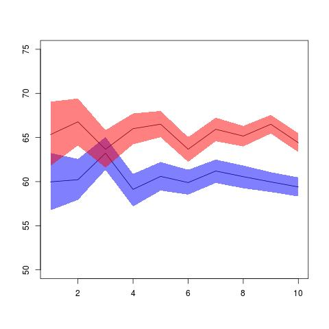

*Due Thursday, 1 December, 1:00 PM*

$5^{n=day}$ points taken off for each day late.

50 points total.

Submit a single knitr file (named `homework6.rmd`), along with a valid PDF output file. Inside the file, clearly indicate which parts of your responses go with which problems (you may use the original homework document as a template). Add your name as `author` to the file's metadata section. Raw R code/output or word processor files are not acceptable.

Failure to name file `homework6.rmd` or include author name may result in 5 points taken off.

### QUESTION 1 ###

**15 points**

Consider the following very simple genetic model (*very* simple -- don't worry if you're not a geneticist!). A population consists of equal numbers of two sexes: male and female. At each generation men and women are paired at random, and each pair produces exactly two offspring, one male and one female. We are interested in the distribution of height from one generation to the next. Suppose that the height of both children is just the average of the height of their parents, how will the distribution of height change across generations?

Represent the heights of the current generation as a dataframe with two variables, m and f, for the two sexes. We can use `rnorm` to randomly generate the population at generation 1:

```{r}
pop <- data.frame(m = rnorm(100, 160, 20), f = rnorm(100, 160, 20))
```

The following function takes the data frame `pop` and randomly permutes the ordering of the men. Men and women are then paired according to rows, and heights for the next generation are calculated by taking the mean of each row. The function returns a data frame with the same structure, giving the heights of the next generation.

```{r}
next_gen <- function(pop) {
    pop$m <- sample(pop$m)
    pop$m <- rowMeans(pop)
    pop$f <- pop$m
    pop
}
```

Use the function `next_gen` to generate nine generations (you already have the first), then use the function `hist` to plot the distribution of male heights in each generation (this will require multiple calls to `hist`). The phenomenon you see is called regression to the mean.  Provide (at least) minimal decorations such as title and x-axis labels.

```{r}
gen.data <- pop
gen.data$gen <- 1
for (i in 2:9) {
  pop <- next_gen(pop[,1:2])
  pop$gen <- i
  gen.data <- rbind(gen.data,pop)
}

gen.max <- max(gen.data$m)
gen.min <- min(gen.data$m)

par(mfrow=c(3,3))
for (j in 1:9) {
  sub.gen <- gen.data[gen.data$gen == j, 'm']
  hist(sub.gen, main=paste("Generation", j), col="purple", xlab="Height", xlim=c(gen.min, gen.max))
}
```


### QUESTION 2 ###

**10 points**

Use the simulated results from question 1 to reproduce (as closely as possible) the following plot in ggplot2.


```{r}
ggplot(gen.data, aes(x=m, y=f)) + geom_point(alpha=0.25) + facet_wrap(~ gen)
```


### QUESTION 3 ###

**10 points**

You calculated the power of a study design in question #2 of assignment 3. The study has two variables, treatment group and outcome. There are two treatment groups (0, 1) and they should be assigned randomly with equal probability. The outcome should be a random normal variable with a mean of 60 and standard deviation of 20. If a patient is in the treatment group, add 5 to the outcome.

Starting with a sample size of 250, create a 95% bootstrap percentile interval for the mean of each group. Then create a new bootstrap interval by increasing the sample size by 250 until the sample is 2500. Thus you will create a total of 10 bootstrap intervals.  Each bootstrap should create 1000 bootstrap samples. (4 points)

Produce a line chart that includes the bootstrapped mean and lower and upper percentile intervals for each group.  Add appropriate labels and a legend. (6 points)

You may use base graphics or ggplot2.  It should look similar to this (in base).




```{r}
set.seed(100)
bootstrapPI <- function(sample.size=250, n.boot=1000, alpha=0.05) {
  treatment <- sample(c(0,1), sample.size, replace = TRUE)
  outcome <- rnorm(sample.size, mean=60, sd=20)
  data <- data.frame(cbind(treatment, outcome))
  fix.outcome <- ifelse(treatment == 1, outcome + 5, outcome)
  
  group.0 <- fix.outcome[treatment == 0]
  group.1 <- fix.outcome[treatment == 1]
  
  means.0 <- replicate(n = n.boot, mean(sample(group.0, length(group.0), replace=TRUE)))
  CI.0 <- quantile(means.0, c(0.025, 0.975))
  means.1 <- replicate(n = n.boot, mean(sample(group.1, length(group.1), replace=TRUE)))
  CI.1 <- quantile(means.1, c(0.025, 0.975))
  
  bounds <- c(mean(means.0), CI.0, mean(means.1), CI.1)
  
  group.0.res <- data.frame(m = bounds[1], lb = bounds[2], ub = bounds[3], treatment = 0, n = sample.size)
  group.1.res <- data.frame(m = bounds[4], lb = bounds[5], ub = bounds[6], treatment = 1, n = sample.size)
  all.res <- rbind(group.0.res, group.1.res)
  return(all.res)
}

bootstrapPI()

interval <- data.frame(m = numeric(0), lb = numeric(0), ub = numeric(0), treatment = numeric(0), n = numeric(0))
for (i in 1:10) {
  interval <- rbind(interval, bootstrapPI(sample.size=250*i, n.boot=1000, alpha=0.05))
  rownames(interval) <- NULL
}

ggplot(data=interval, mapping = aes(x=interval$n, group = factor(treatment))) + geom_ribbon(aes(ymin = lb, ymax = ub, fill = factor(treatment)), alpha = 0.5) + geom_line(aes(y = m)) + labs("x" = "Number of Patients", "y" = "Mean") + scale_fill_discrete(name = "", labels=c("No Treatment","Treatment"))
```


### QUESTION 4 ###

**15 points**

Programming with classes.  The following function will generate random patient information.

```{r}
makePatient <- function() {
  vowel <- grep("[aeiou]", letters)
  cons <- grep("[^aeiou]", letters)
  name <- paste(sample(LETTERS[cons], 1), sample(letters[vowel], 1), sample(letters[cons], 1), sep='')
  gender <- factor(sample(0:1, 1), levels=0:1, labels=c('female','male'))
  dob <- as.Date(sample(7500, 1), origin="1970-01-01")
  n <- sample(6, 1)
  doa <- as.Date(sample(1500, n), origin="2010-01-01")
  pulse <- round(rnorm(n, 80, 10))
  temp <- round(rnorm(n, 98.4, 0.3), 2)
  fluid <- round(runif(n), 2)
  list(name, gender, dob, doa, pulse, temp, fluid)
}
```

1. Create an S3 class `medicalRecord` for objects that are a list with the named elements `name`, `gender`, `date_of_birth`, `date_of_admission`, `pulse`, `temperature`, `fluid_intake`. Note that an individual patient may have multiple measurements for some measurements.  Set the RNG seed to `8` and create a medical record by taking the output of `makePatient`.  Print the medical record, and print the class of the medical record. (5 points)

```{r}
set.seed(8)
patient <- makePatient()
class(patient) <- "medicalRecord"
names(patient) <- c("name", "gender", "dob", "doa", "pulse", "temp", "fluid")

print(patient)
```

2. Write a `medicalRecord` method for the generic function `mean`, which returns averages for pulse, temperature and fluids. Also write a `medicalRecord` method for `print`, which employs some nice formatting, perhaps arranging measurements by date, and `plot`, that generates a composite plot of measurements over time.  Call each function for the medical record created in part 1. (5 points)

```{r}
#install.packages("cowplot")
#library(cowplot)

mean.medrec <- function(data) {
  total.mean <- list(Pulse = mean(data$pulse), Temperature = mean(data$temp), Fluid_Intake = mean(data$fluid))
  return(total.mean)
}


print.medrec <- function(data) {
  cat(sprintf("Name: %s\nGender: %s\nDOB: %s", data$name, data$gender, data$dob), "\n")
  
  visit <- data.frame(doa = data$doa, pulse = data$pulse, temperature = data$temp, fluid_intake = data$fluid)
  visit <- visit[order(visit$doa), ]
  names(visit) <- c("DOA", "Pulse", "Temperature", "Fluid Intake")
  print(visit)
}


plot.medrec <- function(data) {
  visit <- data.frame(doa = data$doa, pulse = data$pulse, temperature = data$temp, fluid_intake = data$fluid)
  visit <- visit[order(visit$doa), ]
  
  p1 <- ggplot(data = visit) + geom_line(mapping = aes(x = visit$doa, y = visit$pulse)) + labs(x = "Dates of Admission", y = "Pulse")
  p2 <- ggplot(data = visit) + geom_line(mapping = aes(x = visit$doa, y = visit$temp)) + labs(x = "Dates of Admission", y = "Temperature")
  p3 <- ggplot(data = visit) + geom_line(mapping = aes(x = visit$doa, y = visit$fluid)) + labs(x = "Dates of Admission", y = "Fluid Intake")
  plot_grid(p1, p2, p3, ncol = 3, nrow = 1)
}


mean.medrec(data = patient)
print.medrec(data = patient)
plot.medrec(data = patient)
```

3. Create a further class for a cohort (group) of patients, and write methods for `mean` and `print` which, when applied to a cohort, apply mean or print to each patient contained in the cohort. Hint: think of this as a "container" for patients.  Reset the RNG seed to 8 and create a cohort of ten patients, then show the output for `mean` and `print`. (5 points)

```{r}
set.seed(8)
cohort <- lapply(1:10, function (data) {makePatient()})
class(cohort) <- "group"
for (i in seq(1:10)) {
  names(cohort[[i]]) <- c("name", "gender", "dob", "doa", "pulse", "temp", "fluid")
}

mean.cohort <- function (data) {
  for (i in 1:10) {
    pulse.cohort <- data[[i]]$pulse
    temp.cohort <- data[[i]]$temp
    fluid.cohort <- data[[i]]$fluid
  }
  
  total.mean <- list(Pulse = mean(pulse.cohort), Temperature = mean(temp.cohort), Fluid_Intake = mean(fluid.cohort))
  return(total.mean)
}
mean.cohort(data = cohort)


print.cohort <- function (data) {
  print(data)
  cat(sprintf("Number in cohort: %s\nPulse: %s\nTemperature: %s\nFluid Intake: %s", length(data), mean.cohort(data)[1], mean.cohort(data)[2], mean.cohort(data)[3]), "\n")
}
print.cohort(data = cohort)
```